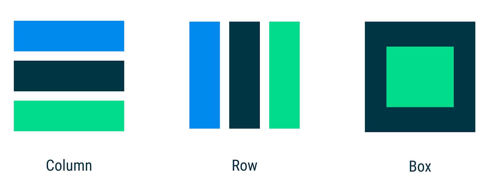

# Layouts in Jetpack Compose Codelab

In the Jetpack Compose basics codelab, you learnt how to build simple UIs with Compose using
composables like Text as well as flexible layout composables such as Column and Row that allow you
to place items (vertically and horizontally, respectively) on the screen and configuring the
alignment of the elements within it. On the other hand, if you don't want items to be displayed
vertically or horizontally, Box allows you to have items behind and/or in front of others.



You can use these standard layout components to build UIs like this one:


```kotlin
@Composable
fun PhotographerProfile(photographer: Photographer) {
    Row(verticalAlignment = Alignment.CenterVertically) {
        Image(...)
        Column {
            Text(photographer.name)
            Text(photographer.lastSeenOnline, ...)
        }
    }
}
```

Thanks to Compose's reusability and composability, you can build your own composables by combining
the different parts needed at the correct level of abstraction together in a new composable
function.

In this codelab, you'll learn how to use Compose's highest level of UI abstraction, Material Design,
as well as low-level composables like Layout that allows you to measure and place elements on the
screen.

If you want to create a Material Design-based UI, Compose has built-in Material components
composables that you can use as we'll see in the codelab. If you don't want to use Material Design
or want to build something that is not in the Material Design specs, you'll also learn about how to
create custom layouts.